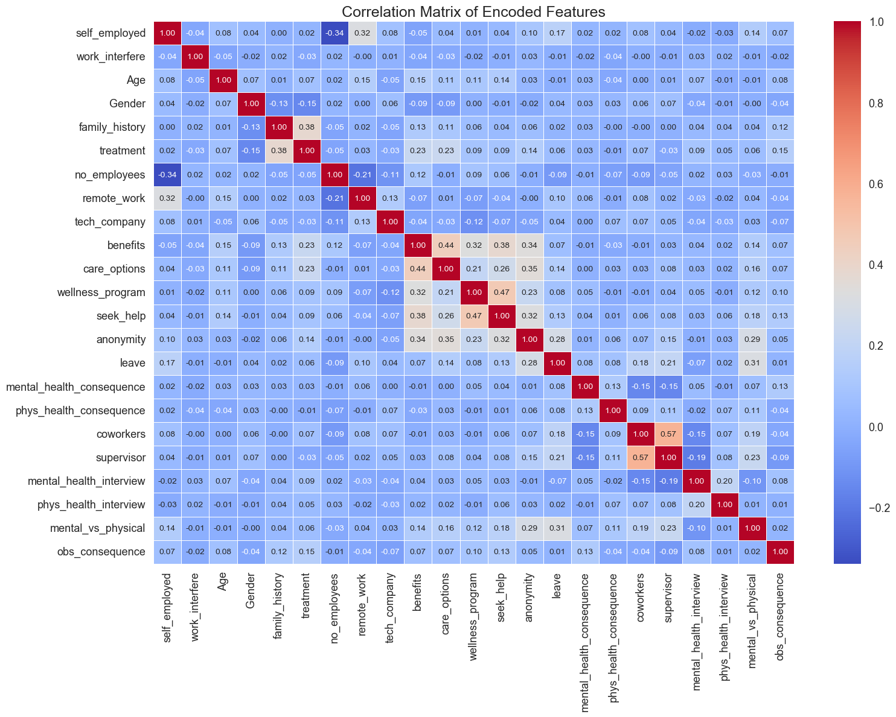
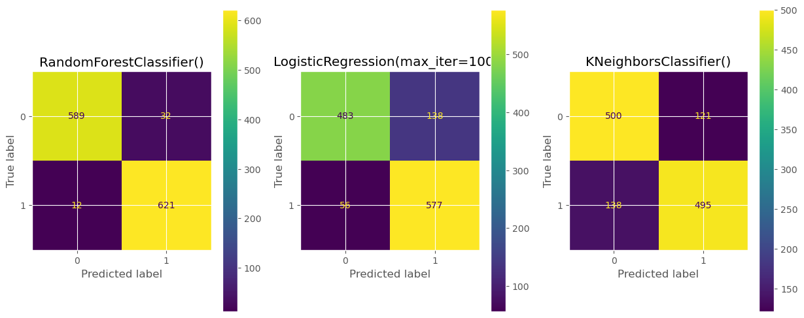
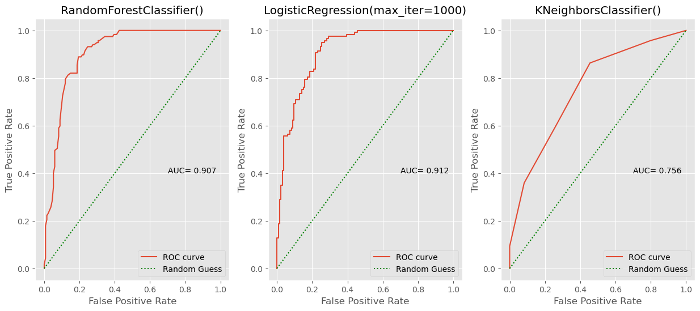

# mental-health-in-tech-prediction
A complete ML project predicting mental health treatment-seeking behavior in the tech industry using the OSMI survey. Includes EDA, model building and evaluation.

This project analyzes the [OSMI Mental Health in Tech Survey](https://www.kaggle.com/datasets/osmi/mental-health-in-tech-survey) to understand factors affecting mental health treatment in the tech industry. It includes exploratory data analysis, model training, evaluation, and an interactive web app using Gradio.

## 📊 EDA Highlights

- Cleaned and imputed missing values (`self_employed`, `work_interfere`, etc.)
- Visualized distributions and treatment rates across features like:
    - Gender, family history, remote work, care options, leave policy, etc.
- Computed a correlation matrix after label encoding all categorical features

## 🧠 Model Building & Evaluation

Constructed a preprocessing pipeline using OneHotEncoder and ColumnTransformer to transform all categorical features into machine-readable format.

-   Built and compared three models:
    - RandomForestClassifier
    - LogisticRegression
    - KNeighborsClassifier

Evaluated models using:
Accuracy Score, Cross-Validation, Confusion Matrix, Classification Report, ROC Curves

Findings:

LogisticRegression achieved a slightly better ROC AUC score, suggesting it was more balanced across thresholds, however since RandomForestClassifier showed higher accuracy during real life thresholds, we chose RandomForestClassifier to use in our app.

